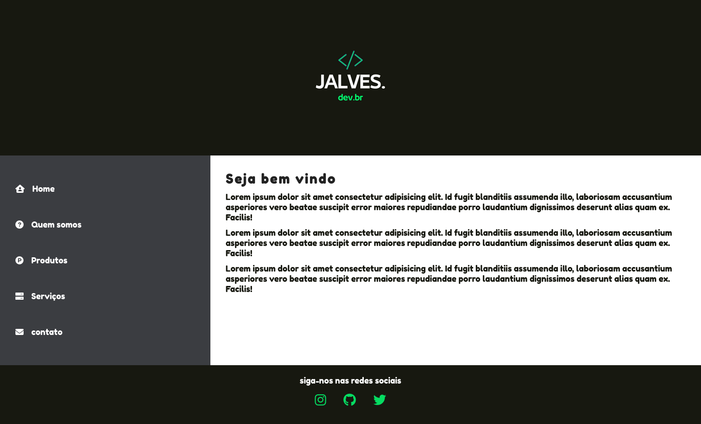

# Formação Full Stack Javascript - Intermediate HTML Website challenge

This is a solution to the intermediate HTML website challenge from Thiago Medeiros course [Formação Full Stack Javascript](https://go.hotmart.com/N73932472N).

## Table of contents

- [Overview](#overview)
  - [The challenge](#the-challenge)
  - [Screenshot](#screenshot)
  - [Links](#links)
- [My process](#my-process)
  - [Built with](#built-with)
  - [What I learned](#what-i-learned)
  - [Useful resources](#useful-resources)
- [Author](#author)

## Overview

### The challenge

Buid a simple site using semantic html and css.

### Screenshot

### Links

- Live Site URL: [jalves.dev.br](http://jalves.dev.br/portfolio/projects/ffjs-html-site/)

## My process

### Built with

- Semantic HTML5 markup
- CSS custom properties

### What I learned

How to use semantic HTML5.

### Useful resources

- [w3schools](https://www.w3schools.com/) - Provided HTML and CSS documentation, helped me remember syntaxes and markups.

- [Formação Full Stack Javascript](https://go.hotmart.com/N73932472N) - This is an amazing couse which helped me to create a solid base for development.

## Author

- Website - [jalves.dev.br](http://jalves.dev.br/)
- Frontend Mentor - [@jalvesdev](https://www.frontendmentor.io/profile/jalvesdev)
- Twitter - [@jalves_dev](https://twitter.com/jalves_dev)